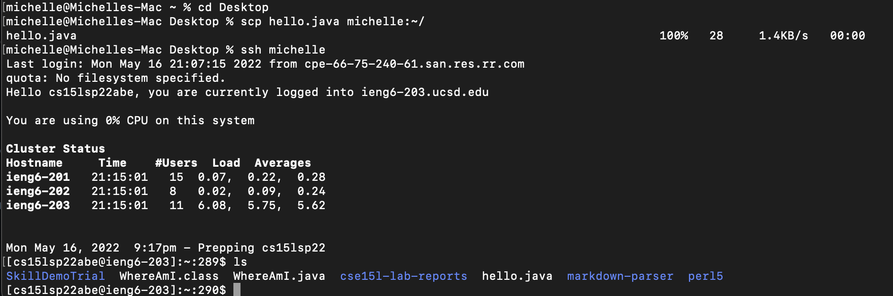

## Lab Report 1: Remote Access
***


*Downloading VS Code*
1. Go to [VS CODE](https://code.visualstudio.com/)  
2. Press the blue download button at the top left 
3. Follow the insturctions given by the site
4. Open on your PC and it should look like this 
(VS screen shot)

*Remotely Connecting*
1. Open VS Code Terminal (Command + ' or Terminal then New Terminal)
2. Then in your termial type ssh and then "cs15lsp22zz@ieng6.ucsd.edu", except replace zz with the 3 letters for your login
3. It will then ask for you to input your password
4. If this is your first connecting, you might get a message saying:
> "The authenticity of host 'ieng6.ucsd.edu (128.54.70.227)' can't be established.
> RSA key fingerprint is SHA256:ksruYwhnYH+sySHnHAtLUHngrPEyZTDl/1x99wUQcec.
> Are you sure you want to continue connecting (yes/no/[fingerprint])?"
if this is the case then press yes. 
5. Once you are connected to the remote server it should look like this:


**YOURE NOW CONNECTED!!!**


*Trying some commands*
Try these commads in your remote access termial!
- cd (name of folder) - change directory
- ls - list of files or direcorties 
- ls -lat - directory size 
- ls -a - gives all files inclding hidden ones(those with dots in the beginning)

**What it should it look like!**


*Moving files using scp*
- the command scp can ne inputed in your terminal to copy and paste a file and it will always run from your personal computer

1. Create a java file on your computer (or use one that has all already been made) and have the following code written in it:

         
```
class WhereAmI' {
  public static void main(String[] args) {
    System.out.println(System.getProperty("os.name"));
    System.out.println(System.getProperty("user.name"));
    System.out.println(System.getProperty("user.home"));
    System.out.println(System.getProperty("user.dir"));
  }
} 
```
2. After this in the terminal not connected to remote access write scp <filename>.java cs15lsp22zz@ieng6.ucsd.edu:~/
         
         -remember to chnage zz to the correct letters for your login
3. you should be prompted with a password that you will enter again which will log you into ieng6.
4. type ls into the terminal after logging in
5. filename.java should be visible in your directory!
6. now run it using javac followed by java

**it should look like this!**



**YOU HAVE SUCCESFULLY COPIED AND PASTED A FILE TO IENG6!!**
         

         
*Setting an SSH Key*
         
An ssh key allows you to copy and paste into the ieng6 server without having to enter a password. Here are the steps to do this:
        
1. on the client terminal (not logged into ieng6) enter: 
- ssh - keygen
- /Users/<user-name>/.ssh/id_rsa
- for this line 'Enter passphrase (empty for no passphrase): ' and this "Enter same passphrase again:" just press enter twice
- you should get something that looks like this 
- The key fingerprint is:
SHA256:jZaZH6fI8E2I1D35hnvGeBePQ4ELOf2Ge+G0XknoXp0 <user-name>@<system>.local
The key's randomart image is:

         +---[RSA 3072]----+

         |                 |

         |       . . + .   |

         |      . . B o .  |

         |     . . B * +.. |

         |      o S = *.B. |

         |       = = O.*.*+|

         |        + * *.BE+|

         |           +.+.o |

         |             ..  |

         +----[SHA256]-----+

2. now you have to copy the public key to the ssh directory using:
- ssh cs15lsp22zz@ieng6.ucsd.edu
- Enter your password
- mkdir .ssh
- exit (brings you back to client)
then on the client 
- scp /Users/<user-name>/.ssh/id_rsa.pub cs15lsp22zz@ieng6.ucsd.edu:~/.ssh/authorized_keys
3. once you follow these steps you should be able to ssh or scp from client to server without entering your password. 

         
         
         
*Optimizing Remote Running*
         
(Copy the java file without having to use your password!)

1. Follow the same steps as with the ssh key (above) 
> you most likely would not have to enter your password again if you already did the ssh keys step
2. When the terminal prompts asks to "Enter file in which to save key (/Users/your username/.ssh/id_rsa):
> Enter the path to the java file: /Users/your name/.ssh/WhereAmI
3. When the terminal asks for the paraphrase press enter twice again (same as in ssh keys)
4. Type ls in the ieng6 terminal and the java file should be there!
         
![Image]

**and thats its youre done!!**
         

         


         
  
         

        
