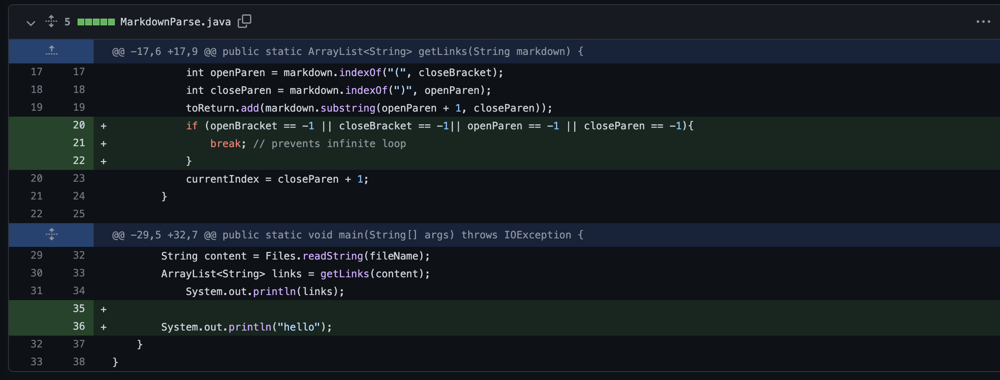
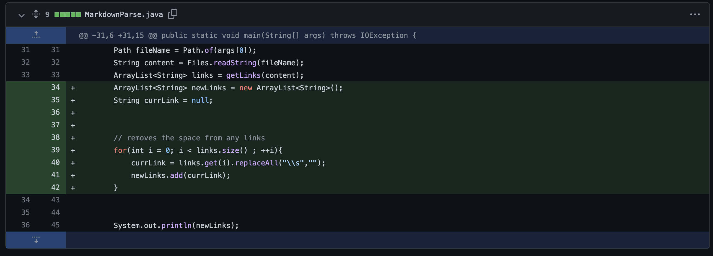
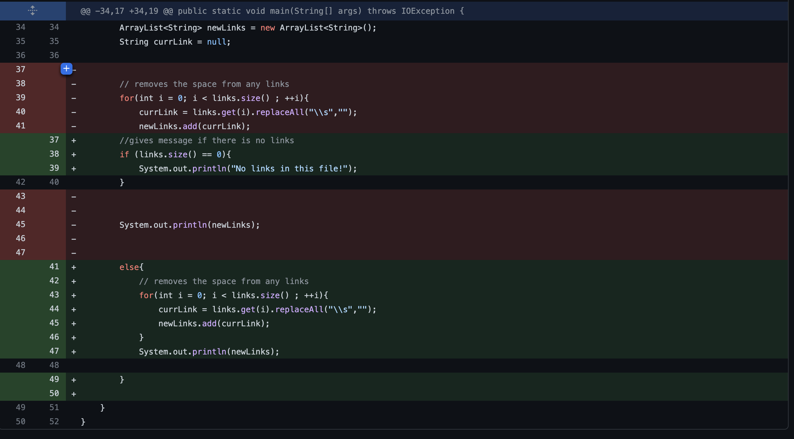

# Fixing the Markdown Parser

## Bug 1: The extra space

The first issue our code stumbled upon was an addition of spaces after the link the last link. To fix this we added  an if statment that took in the consideration of a spaces at the end of the file and ended the while so it wouldn't keep running anymore. 
. 


[Test file 2](https://michellem8.github.io/cse15l-lab-reports/test2.md) had the following output when run through the original program. 

```
\Exception in thread "main" java.lang.OutOfMemoryError: Java heap space
        at java.base/java.util.Arrays.copyOfRange(Arrays.java:3822)
        at java.base/java.lang.StringLatin1.newString(StringLatin1.java:766)
        at java.base/java.lang.String.substring(String.java:2708)
        at MarkdownParse.getLinks(MarkdownParse.java:22)
        at MarkdownParse.main(MarkdownParse.java:33)
```

The bug in the code was that when a file had a space at the end of a file it result in the mesasage above! The symptom of this bug was that the space made the while loop in the program run in a infinite loop until there was no more heap space. 

## Bug 2: Space inside a link

The second bug we discovered is that when a link has a space in it, when the list of the links prints, the one with the space will print with the space in it. To fix this we added for loop that would remove all extra space from the link. 


[Test file 3](https://michellem8.github.io/cse15l-lab-reports/test3.md) had the following output without the fixed code.
```
[https://something.com, some-thing.html, g     oogle.com, dog. org]
```

The bug in the code was that it did not recognize spaces within links and therefore took the string as is with the space. As a result the symptom was that any link containing an accidental space would have it within would be outputted with the space still inside it. 

## Bug 3: An empty file or a file without links

The third bug we discovered was when a file contained no links! To fix this we added an if statement that would address there being no links in the file and instead of null return a message saying "No links in this file!"


[Test file 4](https://michellem8.github.io/cse15l-lab-reports/test4.md) had the following output without the fixed code. 
```
[]
```
The bug in this code was that when a file contained no link, the sympton resulted in the output of empty brackets. This is because the the parser could not detect any brackets or parentheses that contained links inside therefore when a new arraylist had to be made there was nothing to put in it. This results in the empty brackets.


