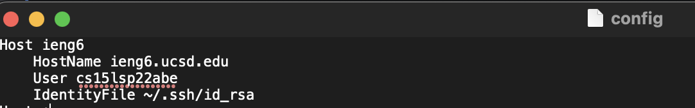
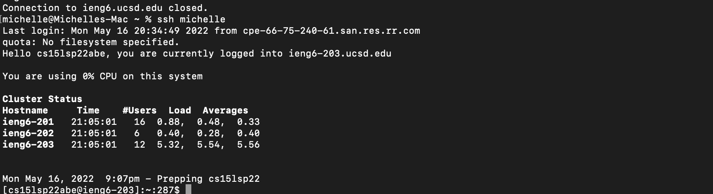
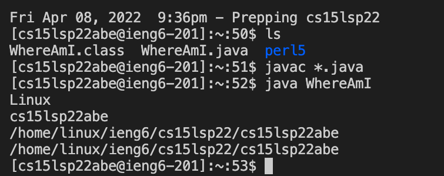
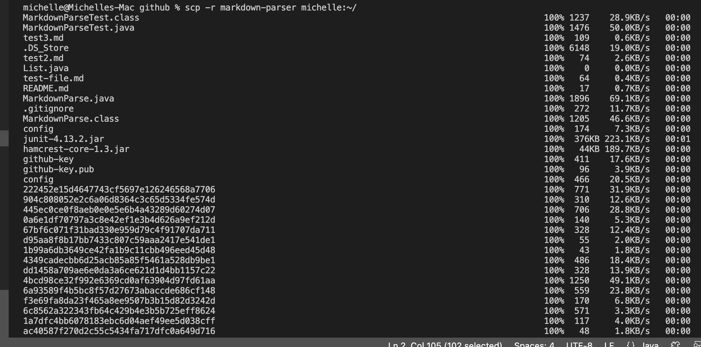
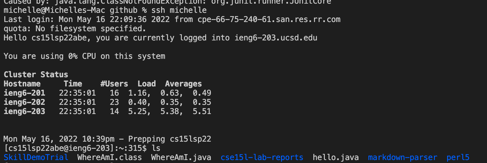
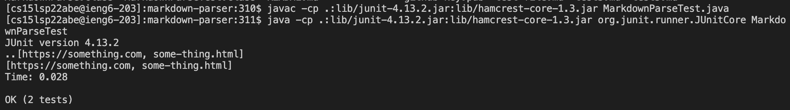
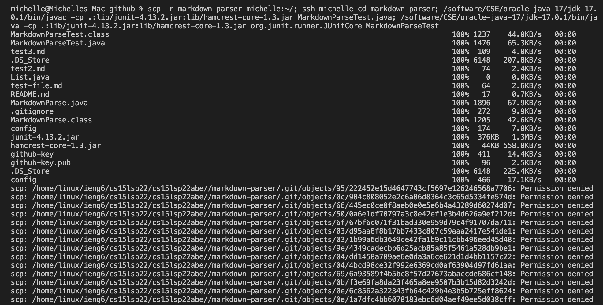
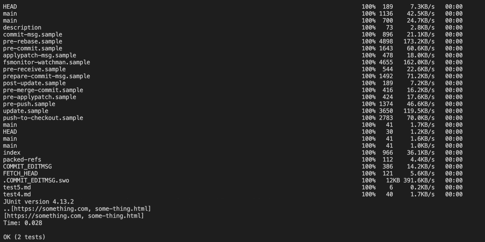

# Lab Report 3
## Streamline SSH Configuration 

1) open up your terminal
2) in your terminal type ```cd .ssh```
3) check if you have a config file by typing ```open config```
4) if there is an error saying the file does not exist, in your terminal type ``` touch config```. This will create a new config file
5) once your config file is created type ```open config``` again. This should open your config file in a text editor. 
6) In the editor copy and paste (feel free to rename the host - first liine that says "Host" - to whatever you would like) and save the file!
```
Host ieng6
    HostName ieng6.ucsd.edu
    User cs15lsp22(your last 3 letters)
    IdentityFile ~/.ssh/id_rsa
```
it should look like this:



once this is created you can now type ``` ssh ieng6``` (or whatever you named the host) into the terminal and your remote account should open!



to copy and paste using the new key just type ```scp filename ieng6:~/```


 
 **And the file should be there!!**
 
 ## Copying Directories
 to copy a whole directory in the terminal type ```scp -r "dir name```
 
 I copied my markdown-parse repository into my ieng6 account using the command ```scp -r markdown-parse michelle:~/```
 
 

Here it is logged into ieng6 directory!



And here is the results after I ran it using the commands in ieng6:
```
javac -cp .:lib/junit-4.13.2.jar:lib/hamcrest-core-1.3.jar MarkdownParseTest.java
java -cp .:lib/junit-4.13.2.jar:lib/hamcrest-core-1.3.jar org.junit.runner.JUnitCore MarkdownParseTest
```


You can also shorten runtime by adding multiple commands to one line using semicolons to seperate each command. In the terminal I wrote:
``` 
scp -r markdown-parser michelle:~/; ssh michelle cd markdown-parser; /software/CSE/oracle-
java-17/jdk-17.0.1/bin/javac -cp.:lib/junit-4.13.2.jar:lib/hamcrest-core-1.3.jar MarkdownParseTest.java; 
/software/CSE/oracle-java-17/jdk-17.0.1/bin/java -cp .:lib/junit-4.13.2.jar:lib/hamcrest-core-1.3.jar 
org.junit.runner.JUnitCore MarkdownParseTest

```

This was the ouput! It runs everything at once:




 
