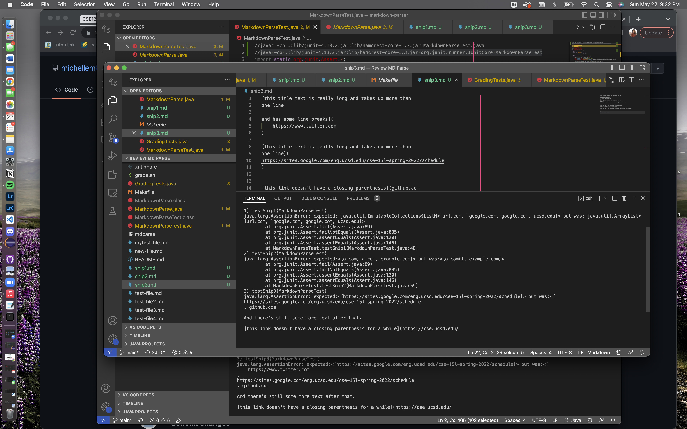

## Snippet 1 Test

To test snippet 1 I implemented the following code:

```
@Test
    public void testSnip1() throws IOException{
        Path fileName = Path.of("snip1.md");
        // Path fileName = Path.of("snippet1.md");
        String content = Files.readString(fileName);
        List<String> links = MarkdownParse.getLinks(content);
        List<String> expected = List.of("url.com, `google.com", "google.com", "ucsd.edu");

        assertEquals(expected, links);
    }
```

This was the output of my implenation for snippet 1:


This was the output of week 7's implementation for snippet 1:


## Snippet 2 Test

To test snippet 2 I implemented the following code:

```
@Test
    public void testSnip1() throws IOException{
        Path fileName = Path.of("snip1.md");
        // Path fileName = Path.of("snippet1.md");
        String content = Files.readString(fileName);
        List<String> links = MarkdownParse.getLinks(content);
        List<String> expected = List.of("url.com, `google.com", "google.com", "ucsd.edu");

        assertEquals(expected, links);
    }
```

This was the output of my implenation for snippet 2:


This was the output of week 7's implementation for snippet 2:


## Snippet 3 Test

To test snippet 3 I implemented the following code:

```
@Test
    public void testSnip1() throws IOException{
        Path fileName = Path.of("snip1.md");
        // Path fileName = Path.of("snippet1.md");
        String content = Files.readString(fileName);
        List<String> links = MarkdownParse.getLinks(content);
        List<String> expected = List.of("url.com, `google.com", "google.com", "ucsd.edu");

        assertEquals(expected, links);
    }
```

This was the output of my implenation for snippet 3:


This was the output of week 7's implementation for snippet 3:



