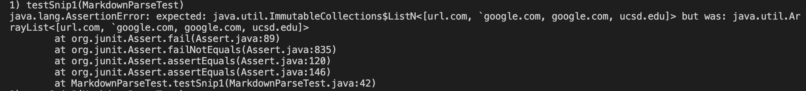
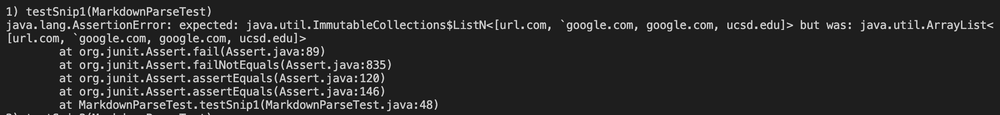
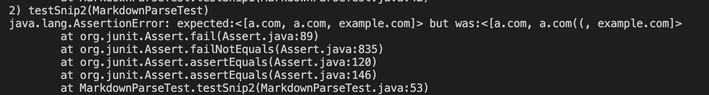
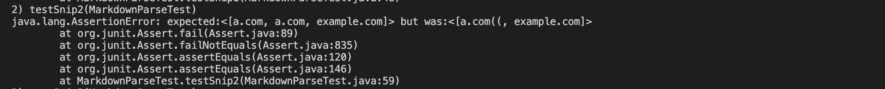
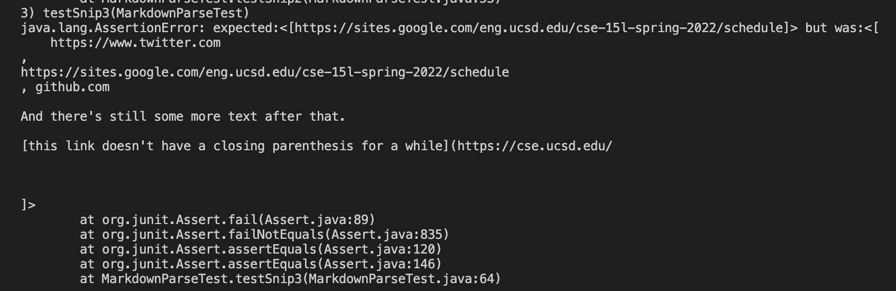
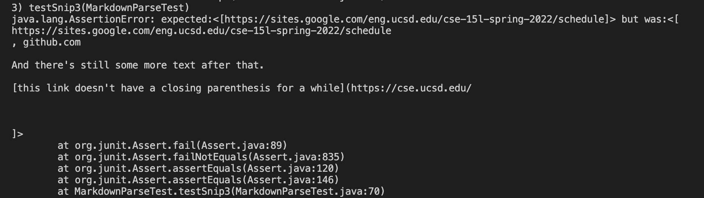

# Clean Coding

These are the two repositories used in this lab:

[My Markdown Parser Repository](https://github.com/michellem8/markdown-parser)

[Markdown Parser I Reviewd](https://github.com/HantianLin/markdown-parser/blob/main/MarkdownParse.java)

## Snippet 1 Test

To test snippet 1 I implemented the following code:

```
@Test
    public void testSnip1() throws IOException{
        Path fileName = Path.of("snip1.md");
        // Path fileName = Path.of("snippet1.md");
        String content = Files.readString(fileName);
        List<String> links = MarkdownParse.getLinks(content);
        List<String> expected = List.of("url.com, `google.com", "google.com", "ucsd.edu");

        assertEquals(expected, links);
    }
```

This was the output of my implenation for snippet 1:


This was the output of week 7's implementation for snippet 1:


I belive that for snippet1 it is possible to make code change that is less than 10 lines because the main problem in both outputs appears to be the expected is an immuatable list and the actual is an arraylist. A quick fix for this would to create an arraylist instead of an immutable list within the test, or change the get links from an arraylist to an immutable list. 

## Snippet 2 Test

To test snippet 2 I implemented the following code:

```
@Test
    public void testSnip2() throws IOException{
        Path fileName = Path.of("snip2.md");
        // Path fileName = Path.of("snippet1.md");
        String content = Files.readString(fileName);
        List<String> links = MarkdownParse.getLinks(content);
        List<String> expected = List.of("a.com", "a.com", "example.com");

        assertEquals(expected, links);
    }
```

This was the output of my implenation for snippet 2:


This was the output of week 7's implementation for snippet 2:


This problem could also be fixed with 10 lines or less. The issue here is that the actual output takes two parentheses as part of the link which could quickly be excluded using an iff statement.

## Snippet 3 Test

To test snippet 3 I implemented the following code:

```
@Test
    public void testSnip3() throws IOException{
        Path fileName = Path.of("snip3.md");
        // Path fileName = Path.of("snippet1.md");
        String content = Files.readString(fileName);
        List<String> links = MarkdownParse.getLinks(content);
        List<String> expected = List.of("https://sites.google.com/eng.ucsd.edu/cse-15l-spring-2022/schedule");

        assertEquals(expected, links);
    }
```

This was the output of my implenation for snippet 3:


This was the output of week 7's implementation for snippet 3:


The issue for this test could also be solved within less than 10 lines. The output of this test takes in all the extra space and doenst return just the link, but I think an if statement to remove all the space and only consider the characters would quickly solve this bug. 

