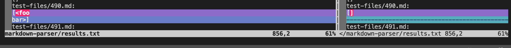

# VimDiff

- I first found tests by first running```bash script.sh > results.txt``` on each of the markdown parsers so that it would create a file within in each direcory containing the results of all the tests. 
- I then ran ```vimdiff markdown-parser/results.txt cse15lsp22-markdown-parser/markdown-parser/results.txt``` in order to compare the results of my markdown parser and the results of markdown parser given week nine.
- I then scrolled to find tests with different outputs and compared the the implementations and tests to see which outputs were correct.  

(*the output for my markdown parser is on the left and the one provided in lab 9 is on the right*)

## Test File 22
The differences in outputs of [Test File 22](https://github.com/nidhidhamnani/markdown-parser/blob/main/test-files/22.md):


*left -> my markdown parser; right-> lab 9 markdown parser*

Based on the preview of the test file for 22, both implementations are incorrect, and the correct output should be ```ti\*tle```. However my markdown parser has the output of ```/bar\* "ti\*tle```and the markdown parser provided in week 9 does not provide any links for the output. 


The problem with the code in the implementation that has been provided is that there is nothing that accounts for the backslashes within the parentheses. Therefore the implementation is not able to find the link due to the backslashes and starts to look for the next set of brackets and parentheses leaving that link empty. 


There should be an if statement within the block of code in the red box that accounts for characters such as backslashes telling the parser to recognize those characters as part of the links.

## Test File 490 
The differences in outputs of [Test File 490](https://github.com/nidhidhamnani/markdown-parser/blob/main/test-files/490.md):


*left -> my markdown parser; right-> lab 9 markdown parser*

Based on the preview, the implementation provided in lab 9 has the correct output, meanwhile my output is incorrect. This is because the output should be empty brackets since there is nothing in the parenthesis in the preview, however the output for my implementation is:
```
<foo
bar>
``` 


The bug is that whenever ```<``` and ```>``` are used in markdown the text inside disapears. Therefore, since the link was inside of those symbols, it will not show up in markdown preview.


In order to fix this, you could either add a method to my markdown parser that recogonizes these symbols and then returns that there is no text inside those symbols, or add an if statement inside the red box stating that any strings between those two symbols would be ignored. 
